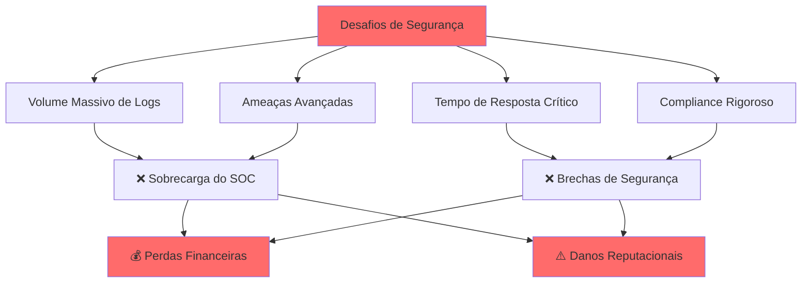
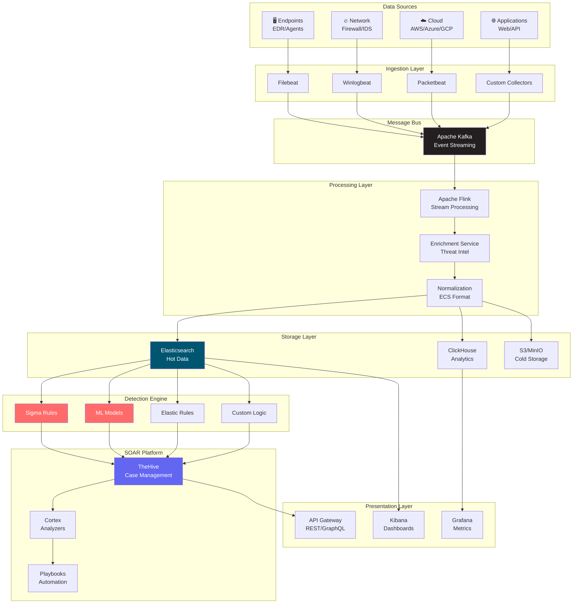

<div align="center">

# 🛡️ SOC Platform

### *Enterprise-Grade Security Operations Analytics & Response*

[](https://www.iso.org/isoiec-27001-information-security.html)
[](https://www.elastic.co/)
[](https://kafka.apache.org/)
[](https://kubernetes.io/)
[](LICENSE)


**[Features](#-principais-recursos)** • 
**[Architecture](#-arquitetura)** • 
**[Quick Start](#-instalação-rápida)** • 
**[Documentation](#-documentação)** • 
**[Security](#-segurança-e-compliance)**

</div>

---

## 🎯 Visão Geral

**SOC Platform** é uma solução enterprise de **Security Operations Center** orientada a dados, projetada para proteger ambientes corporativos através de **detecção inteligente**, **resposta automatizada** e **análise avançada** de ameaças.

### 🚨 O Desafio da Segurança Moderna



### ✨ Nossa Solução

A **SOC Platform** transforma sua postura de segurança com:

- 🔍 **Detecção em Tempo Real** - Identifique ameaças antes que causem dano
- 🤖 **Resposta Automatizada** - Playbooks inteligentes para contenção imediata
- 📊 **Análise Avançada** - ML e IA para detecção de anomalias
- 🔐 **Compliance Nativo** - LGPD, ISO 27001, GDPR by design
- ⚡ **Escalabilidade Ilimitada** - Processe milhões de eventos por segundo

---

## 🌟 Principais Recursos

<table>
<tr>
<td width="50%">

### 🚀 **Ingestão Inteligente**
- Coleta multi-fonte (syslog, APIs, agents)
- Normalização automática de eventos
- Enriquecimento com threat intelligence
- Pipeline tolerante a falhas
- Suporte a 100+ fontes de dados

**Fontes Suportadas:**
- EDR/XDR endpoints
- Firewalls e IDS/IPS
- Cloud providers (AWS, Azure, GCP)
- Active Directory / LDAP
- Web servers e aplicações

</td>
<td width="50%">

### 🎯 **Detecção Avançada**
- Regras Sigma portáveis
- Machine Learning para anomalias
- Threat Intelligence integration
- Behavioral analytics
- Zero-day detection

**Técnicas de Detecção:**
- Rule-based (Sigma, YARA)
- Statistical anomaly detection
- ML clustering e classification
- Threat hunting queries
- Custom detection logic

</td>
</tr>
<tr>
<td width="50%">

### 🤖 **SOAR Integrado**
- Playbooks de resposta automatizada
- Orquestração multi-ferramenta
- Workflow visual builder
- Integração com ticketing
- Comunicação multi-canal

**Integrações:**
- TheHive / Cortex
- Slack, Teams, WhatsApp
- ServiceNow, Jira
- Email, SMS, PagerDuty
- Custom webhooks

</td>
<td width="50%">

### 📈 **Analytics & Dashboards**
- Dashboards em tempo real
- Relatórios executivos
- KPIs de segurança
- Threat intelligence feeds
- Forensics timeline

**Visualizações:**
- Executive overview
- SOC analyst workspace
- Incident timeline
- Threat map geográfico
- Compliance reports

</td>
</tr>
</table>

---

## 🏗️ Arquitetura

### Visão Geral do Sistema



### 🔄 Pipeline de Dados

<table>
<tr>
<th width="20%">Camada</th>
<th width="40%">Componentes</th>
<th width="40%">Função</th>
</tr>

<tr>
<td>

**📥 Ingestão**

</td>
<td>

- Beats (File/Win/Packet)
- Fluentd/Fluent Bit
- Syslog receivers
- API collectors

</td>
<td>

Coleta de eventos de múltiplas fontes com suporte a backpressure e retry logic

</td>
</tr>

<tr>
<td>

**🔄 Transporte**

</td>
<td>

- Apache Kafka
- Topics particionados
- Consumer groups
- Replication

</td>
<td>

Mensageria distribuída com garantia de entrega e alta disponibilidade

</td>
</tr>

<tr>
<td>

**⚙️ Processamento**

</td>
<td>

- Apache Flink
- Spark Streaming
- Enrichment services
- Normalization (ECS)

</td>
<td>

Transformação, enriquecimento e normalização de eventos em tempo real

</td>
</tr>

<tr>
<td>

**💾 Armazenamento**

</td>
<td>

- Elasticsearch (hot)
- ClickHouse (warm)
- S3/MinIO (cold)
- ILM policies

</td>
<td>

Storage hierárquico otimizado para performance e custo

</td>
</tr>

<tr>
<td>

**🎯 Detecção**

</td>
<td>

- Sigma rules
- ML models
- Elastic detection
- Custom analytics

</td>
<td>

Identificação de ameaças usando regras, ML e threat intelligence

</td>
</tr>

<tr>
<td>

**🚨 Resposta**

</td>
<td>

- TheHive
- Cortex analyzers
- Playbooks
- Notifications

</td>
<td>

Orquestração de resposta e automação de remediação

</td>
</tr>

</table>

---

## 📂 Estrutura do Projeto

```
SOC-Platform/
├── 📚 docs/                          # Documentação completa
│   ├── architecture.md              # Arquitetura detalhada
│   ├── deployment.md                # Guia de deploy
│   ├── security.md                  # Políticas de segurança
│   ├── compliance.md                # LGPD, ISO27001, GDPR
│   └── playbooks/                   # Playbooks de resposta
│       ├── ransomware_response.md
│       ├── data_exfiltration.md
│       └── incident_template.md
│
├── 🏗️ infra/                         # Infrastructure as Code
│   ├── terraform/                   # Provisionamento cloud
│   │   ├── aws/
│   │   ├── azure/
│   │   └── gcp/
│   ├── kubernetes/                  # K8s manifests & Helm
│   │   ├── charts/
│   │   └── manifests/
│   └── docker/                      # Docker Compose dev
│
├── 📥 ingest/                        # Coleta de dados
│   ├── beats/                       # Beats configs
│   │   ├── filebeat.yml
│   │   ├── winlogbeat.yml
│   │   └── packetbeat.yml
│   ├── fluentd/                     # Fluentd configs
│   └── collectors/                  # Custom collectors
│       ├── aws_collector/
│       ├── azure_collector/
│       └── gcp_collector/
│
├── 🔄 pipeline/                      # Processamento de dados
│   ├── kafka/                       # Kafka topics & configs
│   ├── flink/                       # Flink jobs
│   ├── spark/                       # Spark streaming
│   └── enrichment/                  # Enrichment services
│       ├── threat_intel/
│       ├── geo_ip/
│       └── asset_inventory/
│
├── 💾 storage/                       # Configurações de storage
│   ├── elasticsearch/               # ES templates & ILM
│   │   ├── index_templates/
│   │   ├── ilm_policies/
│   │   └── ingest_pipelines/
│   ├── clickhouse/                  # ClickHouse schemas
│   └── objectstore/                 # S3/MinIO configs
│
├── 🎯 detection/                     # Detecção de ameaças
│   ├── sigma/                       # Sigma rules (YAML)
│   │   ├── windows/
│   │   ├── linux/
│   │   ├── network/
│   │   └── cloud/
│   ├── elastic_rules/               # Elastic detection rules
│   ├── ml_models/                   # ML para anomalias
│   │   ├── notebooks/
│   │   ├── models/
│   │   └── training_data/
│   └── threat_intel/                # Feeds de threat intel
│
├── 🤖 soar/                          # SOAR & Automação
│   ├── thehive/                     # TheHive configs
│   ├── cortex/                      # Cortex analyzers
│   ├── playbooks/                   # Playbooks automação
│   │   ├── isolation/
│   │   ├── containment/
│   │   └── remediation/
│   └── integrations/                # Integrações externas
│       ├── slack/
│       ├── email/
│       └── ticketing/
│
├── 📊 dashboards/                    # Visualizações
│   ├── kibana/                      # Kibana saved objects
│   │   ├── soc_overview.ndjson
│   │   ├── threat_hunting.ndjson
│   │   └── compliance.ndjson
│   └── grafana/                     # Grafana dashboards
│
├── 🔧 scripts/                       # Scripts utilitários
│   ├── forensics/                   # Scripts forenses
│   ├── threat_hunting/              # Hunting queries
│   └── maintenance/                 # Manutenção
│
├── 🧪 tests/                         # Testes
│   ├── unit/
│   ├── integration/
│   └── e2e/
│
└── 📦 examples/                      # Exemplos e demos
    ├── docker-compose.yml
    ├── sample_data/
    └── demo_scenarios/
```

---

## 🚀 Instalação Rápida

### Pré-requisitos

- Docker 20.10+
- Docker Compose 2.0+ (para dev)
- Kubernetes 1.24+ (para produção)
- Terraform 1.0+ (para IaC)
- Helm 3.0+

### 🐳 Ambiente de Desenvolvimento (Docker Compose)

```bash
# Clone o repositório
git clone https://github.com/SEU-ORG/SOC-Platform.git
cd SOC-Platform

# Configure variáveis de ambiente
cp .env.example .env
# Edite .env com suas configurações

# Suba o ambiente completo
docker-compose -f examples/docker-compose.yml up -d

# Aguarde inicialização (2-3 minutos)
docker-compose ps

# Acesse os serviços
echo "Kibana:        http://localhost:5601"
echo "Grafana:       http://localhost:3000"
echo "TheHive:       http://localhost:9000"
echo "Elasticsearch: http://localhost:9200"
```

### ☁️ Deploy em Produção (Kubernetes)

```bash
# Provisione infraestrutura
cd infra/terraform/aws  # ou azure/gcp
terraform init
terraform plan
terraform apply

# Deploy com Helm
cd ../../kubernetes/charts
helm install soc-platform ./soc-platform \
  --namespace security \
  --create-namespace \
  -f values-production.yaml

# Verifique o deploy
kubectl get pods -n security
kubectl get services -n security
```

### 📊 Carga de Dados de Exemplo

```bash
# Ingeste dados de exemplo para testes
cd examples/sample_data
./load_sample_events.sh

# Verifique no Kibana
curl -XGET "localhost:9200/_cat/indices?v"

# Execute queries de teste
curl -XPOST "localhost:9200/logs-*/_search?pretty" \
  -H 'Content-Type: application/json' \
  -d @sample_queries/test_query.json
```

---

## 🎯 Casos de Uso

### 1️⃣ Detecção de Ransomware

```yaml
# detection/sigma/windows/ransomware_suspicious_encryption.yml
title: Suspicious File Encryption Activity
id: a1b2c3d4-ransomware-detection
status: stable
description: Detects massive file modification indicative of ransomware
logsource:
  product: windows
  service: security
detection:
  selection:
    EventID: 4663
    ObjectType: 'File'
    AccessMask: '0x2'
  timeframe: 60s
  condition: selection | count(ObjectName) > 100
level: critical
```

### 2️⃣ Lateral Movement Detection

```yaml
# detection/sigma/windows/lateral_movement_psexec.yml
title: PsExec Lateral Movement
id: lateral-movement-001
description: Detects PsExec usage for lateral movement
logsource:
  category: process_creation
  product: windows
detection:
  selection:
    - Image|endswith: '\psexec.exe'
    - CommandLine|contains: '\\\\*'
  condition: selection
level: high
```

### 3️⃣ Data Exfiltration

```yaml
# detection/sigma/network/data_exfiltration.yml
title: Large Data Transfer to External IP
id: exfil-001
description: Detects unusual data transfer volumes
logsource:
  category: firewall
detection:
  selection:
    action: 'allowed'
    direction: 'outbound'
    bytes_out: '>1000000000'  # >1GB
  timeframe: 5m
  condition: selection
level: high
```

---

## 🤖 Playbooks de Resposta

### 📋 Template de Playbook

```markdown
# Playbook: Ransomware Response

## 🎯 Objetivo
Contenção rápida de ataque ransomware com preservação de evidências.

## 🚨 Trigger
- Alerta: `ransomware_suspicious_encryption`
- Severidade: CRITICAL
- Confiança: 95%+

## 📊 Verificação Inicial
1. Confirmar quantidade de arquivos afetados
2. Identificar origem (host, usuário, processo)
3. Verificar propagação para outros hosts

## 🔒 Contenção Imediata (Automático)
```python
# Isolamento de rede via API
firewall.block_host(infected_host_ip)
edr.isolate_endpoint(host_id)

# Suspensão de processos maliciosos
edr.kill_process(process_id, process_name)

# Desabilitar conta comprometida
ad.disable_user_account(username)
```

## 🔍 Investigação
```sql
-- Query para timeline de eventos
SELECT timestamp, user, process, file_path, action
FROM events
WHERE host = '{{infected_host}}'
  AND timestamp BETWEEN '{{incident_start}}' AND NOW()
ORDER BY timestamp DESC;
```

## 💾 Preservação de Evidências
- Snapshot do disco
- Dump de memória RAM
- Cópia de logs
- Network capture (PCAP)

## 📢 Comunicação
- **Imediato:** SOC Lead via Slack #incidents-critical
- **15 min:** CISO via email + SMS
- **30 min:** Executivos via email
- **1 hora:** Atualização pública (se aplicável)

## 🔧 Remediação
1. Restaurar de backup (último conhecido bom)
2. Aplicar patches pendentes
3. Fortalecer regras de firewall
4. Atualizar assinaturas de antivírus
5. Revisar privilégios de contas

## 📝 Pós-Incidente
- [ ] Root Cause Analysis completo
- [ ] Atualizar regras de detecção
- [ ] Treinamento adicional para usuários
- [ ] Review de backup procedures
- [ ] Atualização de playbooks

## ⏱️ SLA
- Detecção → Contenção: **5 minutos**
- Contenção → Remediação: **30 minutos**
- Incidente fechado: **24 horas**
```

---

## 🎨 Stack Tecnológico

<div align="center">

### Core Platform

[](https://www.elastic.co/)
[](https://kafka.apache.org/)
[](https://flink.apache.org/)
[](https://clickhouse.com/)

### Detection & Response

[](https://github.com/SigmaHQ/sigma)
[](https://thehive-project.org/)
[](https://virustotal.github.io/yara/)

### Infrastructure

[](https://kubernetes.io/)
[](https://www.terraform.io/)
[](https://www.docker.com/)
[](https://helm.sh/)

### Observability

[](https://www.elastic.co/kibana)
[](https://grafana.com/)
[](https://prometheus.io/)

</div>

---

## 🔐 Segurança e Compliance

### 🛡️ Segurança por Design

<table>
<tr>
<td width="50%">

#### 🔒 Controles Técnicos

- **Criptografia:**
  - TLS 1.3 para dados em trânsito
  - AES-256 para dados em repouso
  - KMS para gerenciamento de chaves
  
- **Autenticação:**
  - SSO via SAML 2.0 / OAuth 2.0
  - MFA obrigatório
  - API keys rotacionados
  
- **Autorização:**
  - RBAC granular
  - Princípio do menor privilégio
  - Segregação de funções

</td>
<td width="50%">

#### 📋 Compliance

- **LGPD (Lei Geral de Proteção de Dados)**
  - Mapeamento de dados pessoais
  - Consentimento e finalidade
  - Direito ao esquecimento
  
- **ISO 27001**
  - ISMS implementation
  - Risk assessment
  - Audit logging
  
- **GDPR**
  - Data protection by design
  - Privacy impact assessment
  - Cross-border transfers

</td>
</tr>
</table>

### 🔍 Auditoria e Governança

```yaml
# Logs de auditoria obrigatórios
audit_events:
  - user_authentication
  - access_to_sensitive_data
  - configuration_changes
  - rule_modifications
  - data_exports
  - admin_actions

retention_policy:
  hot_tier: 30_days      # Elasticsearch
  warm_tier: 90_days     # ClickHouse
  cold_tier: 7_years     # S3/MinIO (compliance)
  
data_classification:
  - Public: No encryption required
  - Internal: Encryption at rest
  - Confidential: Encryption + access logging
  - Restricted: Encryption + MFA + approval workflow
```

---

## 📊 Métricas e KPIs

<div align="center">

### 📈 Métricas Operacionais

| KPI | Target | Atual | Trend |
|-----|--------|-------|-------|
| **MTTD** (Mean Time To Detect) | < 5 min | 3.2 min | ✅ ↓ |
| **MTTR** (Mean Time To Respond) | < 15 min | 12 min | ✅ ↓ |
| **False Positive Rate** | < 5% | 3.8% | ✅ ↓ |
| **Detection Coverage** | > 90% | 94% | ✅ ↑ |
| **System Uptime** | 99.9% | 99.95% | ✅ ↑ |
| **Events/Second** | 100k | 85k | 📊 Stable |

</div>

### 📉 Dashboards Principais

1. **Executive Dashboard**
   - Security posture overview
   - Trend analysis
   - Compliance status
   - Risk metrics

2. **SOC Analyst Workspace**
   - Real-time alerts
   - Investigation tools
   - Case management
   - Playbook execution

3. **Threat Intelligence**
   - IOC feeds
   - Threat landscape
   - Attack patterns
   - Geolocation map

---

## 🧪 Testes e Qualidade

### Test Coverage

```bash
# Testes unitários
pytest tests/unit/ --cov=src --cov-report=html

# Testes de integração
pytest tests/integration/ -v

# Testes end-to-end
pytest tests/e2e/ --selenium

# Security tests
bandit -r src/
safety check
```

### CI/CD Pipeline

```yaml
# .github/workflows/ci.yml
name: SOC Platform CI/CD

on: [push, pull_request]

jobs:
  test:
    runs-on: ubuntu-latest
    steps:
      - uses: actions/checkout@v3
      - name: Run Tests
        run: |
          docker-compose -f docker-compose.test.yml up --abort-on-container-exit
      
  security-scan:
    runs-on: ubuntu-latest
    steps:
      - name: Run Trivy
        run: |
          trivy image soc-platform:latest
      - name: Run tfsec
        run: |
          tfsec infra/terraform/
          
  deploy:
    needs: [test, security-scan]
    runs-on: ubuntu-latest
    if: github.ref == 'refs/heads/main'
    steps:
      - name: Deploy to Production
        run: |
          helm upgrade soc-platform ./charts/soc-platform \
            --namespace production \
            --values values-production.yaml
```

---

## 📚 Documentação

- 📖 [**Documentação Completa**](docs/README.md)
- 🏗️ [**Guia de Arquitetura**](docs/architecture.md)
- 🚀 [**Guia de Deploy**](docs/deployment.md)
- 🔐 [**Políticas de Segurança**](docs/security.md)
- 📋 [**Compliance Guide**](docs/compliance.md)
- 🤖 [**Playbooks**](docs/playbooks/)
- 🔌 [**API Reference**](docs/api/)

---

## 🤝 Contribuindo

Contribuições são bem-vindas! Veja nosso [Guia de Contribuição](CONTRIBUTING.md).

### Como Contribuir

1. Fork o projeto
2. Crie uma branch (`git checkout -b feature/AmazingFeature`)
3. Commit suas mudanças (`git commit -m 'Add AmazingFeature'`)
4. Push para a branch (`git push origin feature/AmazingFeature`)
5. Abra um Pull Request

### 📝 Padrões de Código

- Sigma rules: seguir [Sigma specification](https://github.com/SigmaHQ/sigma-specification)
- Python: PEP 8 + Black formatter
- YAML: yamllint validated
- Terraform: terraform fmt + tflint

---

## 📄 Licença

Este projeto está licenciado sob a Apache License 2.0 - veja [LICENSE](LICENSE) para detalhes.

---

## 👥 Equipe e Suporte

<div align="center">

**Desenvolvido por especialistas em Security Operations**

[](mailto:security@maykonlincoln.com)
[](mailto:maykon_zero@hotmail.com)
[](https://linkedin.com/in/maykonlincoln)

### 💬 Canais de Suporte

- 📧 **Email:** security@maykonlincoln.com
- 💼 **LinkedIn:** [Maykon Lincoln](https://linkedin.com/in/maykonlincoln)
- 🐛 **Issues:** [GitHub Issues](https://github.com/SEU-ORG/SOC-Platform/issues)
- 📚 **Docs:** [Documentation Portal](https://docs.soc-platform.io)

</div>

---

## 🌟 Agradecimentos

Agradecimentos especiais para:
- [Sigma HQ](https://github.com/SigmaHQ/sigma) - Detection rules
- [Elastic](https://www.elastic.co/) - SIEM platform
- [TheHive Project](https://thehive-project.org/) - SOAR capabilities
- [Apache Foundation](https://apache.org/) - Kafka, Flink
- Comunidade de InfoSec

---

## 🛣️ Roadmap

### ✅ Q1 2026 (Concluído)
- [x] Core platform architecture
- [x] Sigma rules integration
- [x] Basic SOAR playbooks
- [x] Elasticsearch + Kafka pipeline

### 🚧 Q2 2026 (Em Progresso)
- [ ] ML-based anomaly detection
- [ ] Advanced threat hunting
- [ ] Mobile app para SOC analysts
- [ ] Enhanced threat intelligence

### 📅 Q3 2026 (Planejado)
- [ ] User Entity Behavior Analytics (UEBA)
- [ ] Deception technology integration
- [ ] Advanced forensics toolkit
- [ ] Multi-tenant support

### 🔮 Q4 2026 (Futuro)
- [ ] AI-powered auto-remediation
- [ ] Quantum-safe cryptography
- [ ] Blockchain audit trail
- [ ] Global threat sharing network

---

<div align="center">

### ⭐ Star este projeto no GitHub!

[](https://github.com/SEU-ORG/SOC-Platform/stargazers)
[](https://github.com/SEU-ORG/SOC-Platform/network/members)
[](https://github.com/SEU-ORG/SOC-Platform/watchers)

**[⬆ Voltar ao Topo](#-soc-platform)**

---

*Protegendo organizações através de inteligência e automação* 🛡️

<sub>Última atualização: Fevereiro 2026</sub>

</div>
