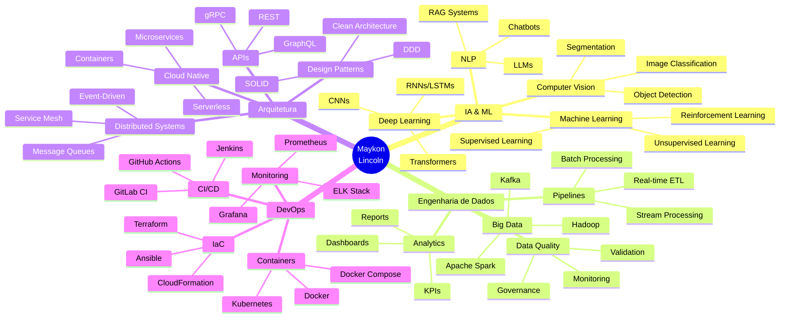

<div align="center">

# 👋 Olá, eu sou Maykon Lincoln!


<br/>

[](https://linkedin.com/in/maykonlincoln)
](https://instagram.com/maykonlincoln)
[](https://maykonlincoln.com)
[](mailto:contato@maykonlincoln.com)


</div>

---

## 🚀 Sobre Mim

> **Arquiteto de Soluções que Escalam Negócios** | Consultoria Internacional 🌎 | BR 🇧🇷 + USA 🇺🇸

Sou **Engenheiro Especialista em Sistemas, Dados & IA** com foco em transformar dados complexos em **soluções inteligentes e escaláveis** que geram valor real para negócios. Com experiência internacional, desenvolvo arquiteturas robustas usando tecnologias de ponta.

### 🎯 Minha Missão

**Construir sistemas que não apenas funcionam, mas que transformam negócios através de dados e inteligência artificial.**

```python
class MaykonLincoln:
    def __init__(self):
        self.name = "Maykon Lincoln"
        self.role = "Data & AI Engineer | Solutions Architect"
        self.location = "Brazil 🇧🇷 | USA 🇺🇸"
        self.expertise = {
            "ai_ml": ["LLMs", "Computer Vision", "NLP", "Predictive Analytics"],
            "data": ["Pipelines", "ETL/ELT", "Big Data", "Data Quality"],
            "cloud": ["AWS", "Azure", "GCP", "Serverless"],
            "architecture": ["Microservices", "Event-Driven", "Clean Code"]
        }
        self.current_focus = ["AI Agents", "RAG Systems", "MLOps", "Cloud Native"]
        
    def build_the_future(self):
        return "Uma linha de código por vez! 🚀"
    
    def collaborate(self):
        return "Sempre aberto a projetos desafiadores e inovadores! 💡"

me = MaykonLincoln()
print(me.build_the_future())
print(me.collaborate())
```

---

## 💼 O Que Eu Faço

<table>
<tr>
<td width="50%" valign="top">

### 🧠 Inteligência Artificial & ML
```yaml
Especialidades:
  - Machine Learning & Deep Learning
  - Modelos Preditivos & Classificação
  - Computer Vision & NLP
  - LLMs & RAG Systems
  - AI Agents & Automation
  - MLOps & Model Deployment
```

**Projetos Recentes:**
- 🤖 Sistemas de agentes inteligentes multi-tarefa
- 👁️ Detecção de objetos em tempo real
- 💬 Chatbots com LLMs e RAG
- 📊 Modelos preditivos para negócios

</td>
<td width="50%" valign="top">

### 📊 Engenharia de Dados
```yaml
Competências:
  - Data Pipelines Escaláveis
  - ETL/ELT & Data Warehousing
  - Big Data & Stream Processing
  - Data Quality & Governance
  - Analytics & Visualization
  - Cloud Data Lakes
```

**Soluções Desenvolvidas:**
- 🔄 Pipelines de dados em tempo real
- 📦 Data Lakes e Warehouses
- 🎯 Dashboards executivos
- ⚡ Processamento distribuído

</td>
</tr>
<tr>
<td width="50%" valign="top">

### 🏗️ Arquitetura de Sistemas
```yaml
Práticas:
  - Clean Architecture & SOLID
  - Microservices & APIs RESTful
  - Event-Driven Architecture
  - Cloud-Native Design
  - Sistemas Distribuídos
  - Security by Design
```

**Expertise:**
- ☁️ Arquitetura multi-cloud
- 🔐 Soluções seguras e escaláveis
- 🚀 Performance & Otimização
- 📈 Sistemas de alta disponibilidade

</td>
<td width="50%" valign="top">

### 💡 Consultoria & Mentoria
```yaml
Serviços:
  - Arquitetura de Soluções
  - Transformação Digital
  - Code Review & Refactoring
  - DevOps & CI/CD
  - Mentoria Técnica
  - Workshops & Treinamentos
```

**Valor Entregue:**
- 📊 Estratégia de dados
- 🎯 Roadmap tecnológico
- 👥 Capacitação de times
- 🔧 Otimização de processos

</td>
</tr>
</table>

---

## 🛠️ Arsenal Tecnológico

<details open>
<summary><b>🔥 Clique para expandir/recolher</b></summary>

### 💻 Linguagens de Programação


### 🤖 AI, ML & Data Science


### 📊 Data Engineering & Big Data


### 📈 Analytics & Visualization


### 🗄️ Databases & Storage


### ☁️ Cloud Platforms


**Serviços AWS:** S3, EC2, Lambda, RDS, Athena, Glue, SageMaker, EventBridge  
**Serviços Azure:** Blob Storage, Functions, Synapse, Machine Learning  
**Serviços GCP:** BigQuery, Cloud Functions, Vertex AI, Dataflow

### 🔧 DevOps & Infrastructure


### 🌐 Frameworks & APIs


### 🛡️ Outros


</details>

---

## 📊 GitHub Analytics

<div align="center">


[](https://git.io/streak-stats)


</div>

---

## 🏆 Projetos em Destaque

<div align="center">

<table>
<tr>
<td width="50%">

### 🤖 [DeliveryWatch AI](https://github.com/maykonlincolnusa/delivery_ia)

**Sistema Enterprise de Monitoramento Inteligente**

Sistema multi-agente de IA para monitoramento de entregas em tempo real com arquitetura cloud-native.

**Tech Stack:**
- CrewAI, AWS, FastAPI
- Multi-Agent System
- Real-time Analytics

[](https://github.com/maykonlincolnusa/delivery_ia)

</td>
<td width="50%">

### 🛡️ [SML - Sistema Modular Inteligente](https://github.com/maykonlincolnusa/SML)

**Plataforma Multi-Domínio com IA**

Sistema modular com IA, visão computacional e automação para segurança, logística, saúde e mais.

**Tech Stack:**
- Computer Vision, ML
- Automation, Analytics
- Modular Architecture

[](https://github.com/maykonlincolnusa/SML)

</td>
</tr>
<tr>
<td width="50%">

### 🧠 [Mini LLM GPT](https://github.com/maykonlincolnusa/mini_llm_gpt)

**Chat Inteligente do Zero**

Implementação educacional de LLM demonstrando fundamentos de NLP e arquitetura profissional.

**Tech Stack:**
- Python, NLP, TF-IDF
- Streamlit
- Clean Architecture

[](https://github.com/maykonlincolnusa/mini_llm_gpt)

</td>
<td width="50%">

### 📊 [ArcaERP](https://github.com/maykonlincolnusa/ArcaERP)

**Sistema ERP Enterprise**

ERP moderno e escalável para gestão empresarial completa.

**Tech Stack:**
- Python, Databases
- RESTful APIs
- Business Intelligence

[](https://github.com/maykonlincolnusa/ArcaERP)

</td>
</tr>
</table>

</div>

### 🌟 Mais Projetos

<div align="center">

[](https://github.com/maykonlincolnusa/LLM-alura-codigo)

</div>

---

## 📈 Expertise & Domínios

<div align="center">



</div>

---

## 💼 Experiência por Domínio

<table>
<tr>
<td align="center" width="16.6%">

### 🔐
**Segurança<br/>Pública**

Sistemas de<br/>monitoramento,<br/>alertas e<br/>detecção

</td>
<td align="center" width="16.6%">

### 🚚
**Logística &<br/>Supply Chain**

Otimização,<br/>rastreamento<br/>e previsão

</td>
<td align="center" width="16.6%">

### 🏥
**Healthcare &<br/>Saúde**

Análise preditiva,<br/>diagnóstico<br/>assistido

</td>
<td align="center" width="16.6%">

### 📊
**Marketing &<br/>Analytics**

Automação,<br/>segmentação<br/>e insights

</td>
<td align="center" width="16.6%">

### 🌱
**Meio<br/>Ambiente**

Monitoramento,<br/>análise e<br/>sustentabilidade

</td>
<td align="center" width="16.6%">

### 🏭
**Indústria &<br/>Manufatura**

IoT, otimização<br/>e manutenção<br/>preditiva

</td>
</tr>
</table>

---

## 🎯 Aprendizado Contínuo & Foco Atual

<table>
<tr>
<td width="50%">

### 🔥 Estudando Agora

- 🤖 **LLMs & Prompt Engineering**
  - Fine-tuning de modelos
  - RAG (Retrieval-Augmented Generation)
  - Agent frameworks (CrewAI, LangChain)

- ⚡ **MLOps & Production ML**
  - Model versioning e tracking
  - A/B testing de modelos
  - Monitoring e observability

- 🌐 **Advanced Cloud Architecture**
  - Multi-cloud strategies
  - Serverless patterns
  - Event-driven systems

</td>
<td width="50%">

### 🎯 Próximos Objetivos

- [ ] Certificação AWS ML Specialty
- [ ] Contribuir para 10+ projetos open source
- [ ] Publicar 20+ artigos técnicos
- [ ] Desenvolver framework próprio de MLOps
- [ ] Palestrar em conferências internacionais
- [ ] Expandir consultoria global

</td>
</tr>
</table>

---

## 💡 Filosofia & Princípios

<div align="center">

### 🎨 Meus Valores Profissionais

<table>
<tr>
<td align="center" width="25%">

**🔍 Qualidade**

Código limpo,<br/>bem testado e<br/>documentado

</td>
<td align="center" width="25%">

**🚀 Inovação**

Sempre explorando<br/>novas tecnologias<br/>e abordagens

</td>
<td align="center" width="25%">

**🤝 Colaboração**

Compartilhamento<br/>de conhecimento<br/>e mentoria

</td>
<td align="center" width="25%">

**📈 Impacto**

Soluções que geram<br/>valor real para<br/>o negócio

</td>
</tr>
</table>

---

> *"Dados são o novo petróleo, mas apenas quando refinados em **insights acionáveis** se tornam valiosos."*

> *"Código limpo não é código que funciona - é código que **outros conseguem entender, manter e evoluir**."*

> *"A melhor arquitetura é aquela que **resolve o problema de hoje** e permite **escalar para o amanhã**."*

> *"Inteligência Artificial não substitui humanos - **amplifica** nossas capacidades quando bem aplicada."*

</div>

---

## 🤝 Vamos Trabalhar Juntos?

<div align="center">

### Estou disponível para:

<table>
<tr>
<td align="center" width="25%">

### 💼
**Consultoria**

Arquitetura de<br/>soluções em<br/>Data & IA

</td>
<td align="center" width="25%">

### 🚀
**Projetos**

Desenvolvimento<br/>de sistemas<br/>complexos

</td>
<td align="center" width="25%">

### 🎓
**Mentoria**

Orientação técnica<br/>e code review

</td>
<td align="center" width="25%">

### 🎤
**Palestras**

Workshops e<br/>apresentações<br/>técnicas

</td>
</tr>
</table>

</div>

---

## 📫 Entre em Contato

<div align="center">

### 🌐 Canais de Comunicação

[](https://linkedin.com/in/maykonlincoln)
[]
[](https://instagram.com/maykonlincoln)
[](https://maykonlincoln.com)
[](https://wa.me/seu_numero)

---

### 📊 Estatísticas Rápidas


</div>

---

## 🏆 Conquistas & Reconhecimentos

<div align="center">

| 🎯 Categoria | 📊 Métrica | ⭐ Status |
|-------------|-----------|----------|
| **Projetos Open Source** | 50+ repositórios | ✅ Ativo |
| **Contribuições** | 1000+ commits/ano | ✅ Consistente |
| **Stars Recebidas** | 88+ stars | 📈 Crescendo |
| **Followers** | Comunidade ativa | 🤝 Engajado |
| **Consultoria** | BR + USA | 🌎 Internacional |

</div>

---

## 📚 Blog & Conteúdo

<div align="center">

*Em breve: artigos técnicos sobre IA, Data Engineering e Arquitetura de Sistemas*

### 🎬 Tópicos que Abordo

`Machine Learning` • `Data Engineering` • `Cloud Architecture` • `MLOps` • `AI Agents` • `System Design` • `Clean Code` • `Best Practices`

</div>

---

## 🎯 Metas para 2026

<div align="center">

| Meta | Progresso | Status |
|------|-----------|--------|
| Publicar 20+ artigos técnicos | ▰▰▰▱▱▱▱▱▱▱ | 🟡 Em andamento |
| Contribuir 10+ projetos OS | ▰▰▱▱▱▱▱▱▱▱ | 🟡 Em andamento |
| 3 projetos MLOps de referência | ▰▱▱▱▱▱▱▱▱▱ | 🟡 Planejado |
| Expandir consultoria internacional | ▰▰▰▰▱▱▱▱▱▱ | 🟢 Em progresso |
| Palestrar em 5+ eventos | ▱▱▱▱▱▱▱▱▱▱ | 🔵 Planejado |
| Certificações AWS & Azure | ▰▰▰▱▱▱▱▱▱▱ | 🟡 Estudando |

</div>

---

## 🌟 Open Source & Contribuições

<div align="center">

[](https://github.com/maykonlincolnusa)

[](https://github.com/ryo-ma/github-profile-trophy)

</div>

---

## 💝 Apoie Meu Trabalho

<div align="center">

Se você gosta do meu trabalho e quer apoiar:

⭐ **Star** nos repositórios que achar úteis
<br/>
🔄 **Fork** e contribua com melhorias
<br/>
📢 **Compartilhe** com sua rede
<br/>
💬 **Feedback** é sempre bem-vindo
<br/>
🤝 **Colabore** em projetos open source

---

### 🎁 Quer retribuir?

[](https://buymeacoffee.com/maykonlincoln)
[](https://github.com/sponsors/maykonlincolnusa)

</div>

---

<div align="center">

## 🚀 Vamos Construir o Futuro Juntos!

**Transformando dados em valor • Código em soluções • Ideias em realidade**

---


---

<sub>

**📅 Última Atualização:** Fevereiro 2026  
**💻 Desenvolvido com:** Muito ❤️, ☕ e código limpo  
**🎯 Objetivo:** Impactar positivamente através da tecnologia

</sub>

<br/>

**⬆️ [Voltar ao Topo](#-olá-eu-sou-maykon-lincoln)**

</div>
