<div align="center">

# 👋 Olá, eu sou Maykon Lincoln!


<br/>

[](https://linkedin.com/in/maykonlincoln)
[](https://instagram.com/maykonlincoln)
[](https://maykonlincoln.com)
[](https://github.com/maykonlincolnusa?tab=followers)

</div>

---

## 🚀 Sobre Mim

> **Construo arquiteturas que escalam negócios** | Consultoria no Brasil e EUA 🌎

Sou **Engenheiro de Sistemas, Dados & IA** especializado em transformar dados em soluções inteligentes e escaláveis. Com experiência internacional, desenvolvo sistemas que resolvem problemas reais de negócio usando tecnologias de ponta.

```python
class MaykonLincoln:
    def __init__(self):
        self.location = "Brazil 🇧🇷 | USA 🇺🇸"
        self.current_focus = ["AI/ML", "Data Engineering", "System Architecture"]
        self.learning = ["LLMs", "RAG", "MLOps", "Cloud Native"]
        
    def say_hi(self):
        print("Construindo o futuro, uma linha de código por vez! 🚀")

me = MaykonLincoln()
me.say_hi()
```

### 💼 O Que Eu Faço

<table>
<tr>
<td width="50%">

#### 🧠 Inteligência Artificial
- Machine Learning & Deep Learning
- Modelos preditivos e classificação
- Computer Vision & NLP
- LLMs e Agentes Inteligentes

</td>
<td width="50%">

#### 📊 Engenharia de Dados
- Pipelines de dados escaláveis
- ETL/ELT & Data Warehousing
- Big Data & Streaming
- Data Quality & Governance

</td>
</tr>
<tr>
<td width="50%">

#### 🏗️ Arquitetura de Sistemas
- Microservices & APIs
- Cloud Architecture (AWS, Azure, GCP)
- DevOps & CI/CD
- Sistemas distribuídos

</td>
<td width="50%">

#### 💡 Consultoria Tech
- Arquitetura de soluções
- Transformação digital
- Otimização de processos
- Mentoria técnica

</td>
</tr>
</table>

---

## 🛠️ Stack Tecnológica

### 💻 Linguagens


### 🤖 AI & Machine Learning


### 📊 Data Engineering & Analytics


### 🗄️ Databases


### ☁️ Cloud & DevOps


### 🌐 Frameworks & Tools


---

## 📊 GitHub Stats

<div align="center">


</div>

<div align="center">

[](https://git.io/streak-stats)

</div>

---

## 🏆 Projetos em Destaque

<div align="center">

[](https://github.com/maykonlincolnusa/SML)
[](https://github.com/maykonlincolnusa/mini_llm_gpt)
[](https://github.com/maykonlincolnusa/ArcaERP)
[](https://github.com/maykonlincolnusa/LLM-alura-codigo)

</div>

### 🌟 Destaques dos Projetos

#### 🤖 [SML - Sistema Modular Inteligente](https://github.com/maykonlincolnusa/SML)
> Sistema inteligente e modular com IA, visão computacional, automação e dados. Atende segurança pública, operações, marketing, saúde, meio ambiente e logística.

**Stack:** Python • Computer Vision • ML • Automation

---

#### 🧠 [Mini LLM GPT](https://github.com/maykonlincolnusa/mini_llm_gpt)
> Chat inteligente desenvolvido do zero demonstrando fundamentos de IA, ML e arquitetura de software profissional.

**Stack:** Python • NLP • TF-IDF • Streamlit

---

#### 📊 [ArcaERP](https://github.com/maykonlincolnusa/ArcaERP)
> Sistema ERP moderno e escalável para gestão empresarial.

**Stack:** Python • Database • API • Business Intelligence

---

## 📈 Áreas de Especialização

```mermaid
mindmap
  root((Maykon Lincoln))
    Inteligência Artificial
      Machine Learning
      Deep Learning
      Computer Vision
      NLP & LLMs
    Engenharia de Dados
      ETL/ELT
      Data Pipelines
      Big Data
      Data Quality
    Arquitetura
      Microservices
      Cloud Native
      API Design
      System Design
    DevOps
      CI/CD
      Docker/K8s
      Terraform
      Monitoring
```

<div align="center">



</div>

---

## 💼 Experiência

### 🎯 Domínios de Negócio

<table>
<tr>
<td align="center" width="20%">

🔐
<br/>
**Segurança Pública**
<br/>
<sub>Sistemas de alerta<br/>e monitoramento</sub>

</td>
<td align="center" width="20%">

🚚
<br/>
**Logística**
<br/>
<sub>Otimização<br/>e rastreamento</sub>

</td>
<td align="center" width="20%">

🏥
<br/>
**Saúde**
<br/>
<sub>Análise preditiva<br/>e diagnóstico</sub>

</td>
<td align="center" width="20%">

📊
<br/>
**Marketing**
<br/>
<sub>Analytics<br/>e automação</sub>

</td>
<td align="center" width="20%">

🌱
<br/>
**Meio Ambiente**
<br/>
<sub>Monitoramento<br/>e análise</sub>

</td>
</tr>
</table>

---

## 📚 Aprendizado Contínuo

Atualmente estudando e implementando:

- 🔥 **LLMs & RAG** - Sistemas de recuperação aumentada
- ⚡ **MLOps** - Produtização de modelos ML
- 🌐 **Distributed Systems** - Arquiteturas escaláveis
- 🤖 **AI Agents** - Agentes autônomos inteligentes
- ☁️ **Cloud Native** - Arquitetura para cloud

---

## 📫 Como Me Encontrar

<div align="center">

[](https://linkedin.com/in/maykonlincoln)
[](mailto:contato@maykonlincoln.com)
[](https://instagram.com/maykonlincoln)
[](https://maykonlincoln.com)

</div>

---

## 💡 Filosofia de Trabalho

<div align="center">

> *"Dados são o novo petróleo, mas apenas quando refinados em insights acionáveis."*

> *"Código limpo não é código que funciona - é código que outros conseguem entender, manter e evoluir."*

> *"A melhor arquitetura é aquela que resolve o problema de hoje e permite escalar para o amanhã."*

</div>

---

## 🤝 Colaboração

Estou sempre aberto a:

- 💼 **Oportunidades de consultoria** em Data & IA
- 🤝 **Colaboração em projetos** open source
- 🎓 **Mentoria técnica** para desenvolvedores
- 💬 **Discussões técnicas** sobre arquitetura e ML
- 📊 **Palestras e workshops** sobre tecnologia

---

## 📊 Métricas de Atividade

<div align="center">


</div>

---

## 🌟 Contribuições

<div align="center">


</div>

---

## 🎯 Objetivos 2026

- [ ] Publicar 10+ artigos técnicos sobre IA e Data Engineering
- [ ] Contribuir para 5 projetos open source relevantes
- [ ] Desenvolver 3 projetos de referência em MLOps
- [ ] Expandir consultoria para mercado internacional
- [ ] Ministrar workshops sobre LLMs e RAG

---

<div align="center">

### 💝 Gostou do Meu Trabalho?

⭐ **Star** nos repositórios que você achar interessantes!
<br/>
🔄 **Fork** e contribua com melhorias!
<br/>
📬 **Entre em contato** para colaborações!

---

**Desenvolvido com ❤️ e muito ☕ por Maykon Lincoln**

<sub>Última atualização: Fevereiro 2026</sub>

</div>
